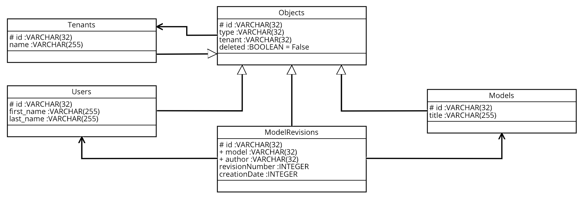

# CompuCom Data Engineering Coding Challenge

## Section 1: Welcome to your CompuCom Coding Challenge for Data Engineers!
This repository is exclusively used for your coding challenge and can be modified to your needs. 
The parts of the challenge are independent from each other.
In case you get the feeling that you are not able to achieve one of the tasks, as it might be not specified
clearly, the code is not running, or for any other reason, please continue with the next task.
In case that a task is not specific enough and you might have to choose one of several solutions, please do so, and we
discuss the solution during the technical interview.

All tasks can be done without installing a specific development environment.
Nevertheless, in case you decide to install requirements, unit tests for each part of the challenge are included
that enable you to check your results by yourself.
All the necessary requirements are easier to prepare on Mac OS or Linux.

The rest of this document is structured as follows:
Section 2 will cover installation instructions for the development environment and introduces the development model for
the coding challenge.
In Section 3, we will introduce you to the general setup for all parts of the coding challenge, in order to set these
tasks into an enterprise context.
Section 4 contains the data retrieval part of the coding challenge where you are tasked to use SQL to answer questions
regarding the application.
Section 5 will guide you through the exercise to implement data related business logic.
In Section 6, we will introduce a forecasting scenario, which needs some imoplementation effort.
In the final Section, we will conclude the coding challenge.

## Section 2: Development Environment Setup and Methodology
This section will cover the environmental setup for your coding challenge.
If you decide to not run the unit tests to validate your results, this section can be skipped.

### General Remarks
This coding challenge is based on **Python**, currently using version 3.7.2.
Some parts can be executed and answered without specific knowledge.
Each part will contain one or more examples that should cover the required basics.
In addition, you need to have **git** installed in order to checkout, create, commit, and push your results to be
reviewed before the technical interview.

### Native Development Environment Installation 
If you decide to install the development environment natively, you need the following tools:

  * Python 3.7, or above
  * [pip] package manager for your Python version
  * git

In case you decide to run Python natively, we strongly recommend to install a virtual environment for this challenge.
This should avoid any side effects regarding packages already installed on your system.
Decent instructions on how to install the environment can be found in
[The Hitchhiker's Guide to Python - Pipenv & Virtual Environments].

After you installed your virtual environment, including the package manager [pip],
please change into this repository's root and execute `pip install --upgrade -r requirements.txt` to install all
requirements.

Now you should be ready to roll!

### Docker-based Development Environment
In case you prefer to run the coding challenges tests inside a docker container, you need to fulfill the following
requirements:

 * have a running docker environment
 * you are able to log into [docker hub]
 * have `make` installed

If all of these requirements are fulfilled, you should be able to execute the following commands:

 * `make run`, to start the container for execution. This will copy your files into the container.
 * `make dev`, to start a container and enter it for development purposes. This will map your files into the container
 * `make tests`, to execute all unit tests
 * `make challenge_one`, to execute only relevant tests for the challenge of Section 4
 * `make challenge_two`, to execute only the relevant tests Section 5's challenge
 * `make challenge_three`, to execute the tests for Section 6 challenge

As stated before: You are ready to roll!

### Manual Test Execution
In case you did not chose to run the coding challenge inside of a container, you can always execute `py.test`
in the coding challenges root in order to execute the unit tests for result validation.

### Test Database (Re)creation
This repository contains a test database that can be used for data storage and analysis.
In case you break the database for whatever reason you can always either revert it to the state stored inside
the repository or execute the `generate_database.py` scripted located inside the **resources** directory.

### Git Branches
For the rest of the challenge, please consider the following branching model: Each challenge should get at least one
separate branch for development and testing.
In case you finish a part, please merge it into the master using a pull request.
If you cannot finish one of the challenges, please leave the branch open for discussion.

## Section 3: The Universe in a Nutshell
As we already discussed CompuCom's software, development process, and the journey ahead in our interview,
this section will give you some detailed overall picture of the data and data structures used for the coding challenge.
All similarities to existing persons or software you might see are unintentional.

As you will figure out, the coding challenge uses SQLite3 as a database.
Please do not be afraid of that, we do not use SQlite for anything other than this coding challenge ;).

### The Application
Imagine, you are an engineer working on a Software as a Service business process modelling application.
Multiple companies use your application everyday, each separated into a separate tenant.
While the users of the application work for a specific company, they are only allowed to model processes for one tenant.
Each of these models contains the information about a business process, such as the ordering of goods.
While the process changes during its lifetime, it is modified by the companies users.
Therefore the application creates a new revision with the models content, enabling analysis on a processes lifecycle.

It will be your task as an engineer at the software providers side to analyze existing data, implement some application
logic, and building a proof-of-concept feature.

#### Database Schema
The data schema of the application consists out of five tables:
  * *Objects*, containing all objects that are used inside the application. Each object belongs to a specific tenant.
  * *Tenants*, containing all tenants of the application.
  * *Users*, containing the first and last names of the users that model inside the application
  * *Models*, containing the meta data of all models created by the applications users, and
  * *ModelRevisions*, containing all versions of a specific model.

## Section 4: Data Analysis and Retrieval
For this part of the challenge, you need to write several SQL queries that are then tested with the database.
Please implement all queries as shown in `coding_challenge/data_analysis_and_retrieval.py`.
To validate your results, you can execute `py.test tests/test_data_analysis_and_retrieval.py`.

The questions that need to be answered are:

  * **active_tenants**: Who are the active tenants?
   A tenant is active, in case users exist that are not marked for deletion.
  * **model_count_of_largest_tenant**: How many models does the largest tenant (by number of users) have?
  * **revision_heaviest_tenant_one**: Which tenant has the most un-deleted model revisions?
  * **revision_heaviest_tenant_two**: What is the title of the most recently edited model of that tenant?
  * **lazy_users**: How many not deleted users have never edited a model?

Please implement your queries in the corresponding functions in `coding_challenge/data_analysis_and_retrieval.py`.

## Section 5: Application Logic
For scalability, maintainability and portability reasons, some queries and logic of our is implemented within
the application, instead of pure SQL queries.
This is even true for functionality that is provided by the database.
One reason is that we have to support at least four major relational databases, which each having its own SQL dialect.

For this part of the coding challenge, we would like you to implement some data related functionality within Python,
rather then in SQL.
For details on the implemented functions, please refer to the Python documentation in
`coding_challenge/application_logic.py`.
To validate your results, you can execute `py.test tests/test_application_logic.py`.
In order to retrieve data from the database, please use the predefined methods of the `DataLoader`.

For your implementation, you are free to implement as many objects, methods, functions, and additional tests as
necessary.
In case you decide to implement some tests, please add them to the `TestCustomApplicationLogic` class.
The only limitations and rules you should follow are:
  * do not modify the function names themselves, as this will break the implemented tests
  * add all implementations to the file already present in the repository
  * to retrieve objects from the database, you have to use the `DataLoader` instance.
    It is not allowed to write custom SQL queries, even if we would prefer them in some cases.
  * in order to interact with the database objects, please use the provided [dataclass] classes `Object`, `Model`,
    `ModelRevision`, `Tenant`, and `User`.

The to-be-implemented functions are described in detail below.

### *get_chronological_ordered_model_revisions(database_file_path, model_id)* 
This function should return all revisions of a specific model, ordered by the *creation_date* in ascending order.
Please return instances of `ModelRevision`, instead of plain tuples.

### *get_most_active_user(database_file_path, tenant_id)*
This function returns a list of users that created the most revisions within a specific tenant.
In general, we expect this list to contain only one entry.
Nevertheless, in the rare case that multiple users have created the same number of model revisions, all users
should be returned.
The returned list should contain `User` instances.

### *get_ordered_list_of_active_model_titles(database_file_path, tenant_id, case_sensitive)*
This function should return a list with the titles of all active models of a tenant.
The list should be lexicographically ordered, either case sensitive or case insensitive, depending on the
corresponding parameter.
In general, the alphabetical order should be preserved with upper case letters have precedence over lower case letters.
Please implement the actual sorting functionality in `sort_string_list(string_list, case_sensitive)`.

## Section 6: Forecasting
For this challenge, we would like you to implement the following into `coding_challenge/report_generation.py`:

The goal is to forecast the expected model growth rate of the application. The model growth rate is defined as

        growth_rate_{t2} = 1 + ((models_{t2} + revisions_{t2} / (models_{t1} + revisions_{t1}))

where _t1_ and _t2_ represent the number of entities at that time. The expected model growth is an estimate based on
past values.

the actual implementation can reuse parts of prior code challenges, such as the *dataclasses*, or the function
`fetch_results_from_database(query: str)`. All implementations should be done in `coding_challenge/forecasting.py`
with tests located in `tests/test_forecasting.py`

## Section 7: Conclusion
We hope you enjoyed reading this document and passing all tests of the coding challenge.
In case you had some issues with specific tasks, please prepare to discuss you concerns during the interview.

In addition, we would like to add that the challenges you just completed only represent an abstracted subset of
tasks and challenges you will master together with your team while working at CompuCom.
The challenge was not intended to give a detailed overview about the work itself, rather to open up a discussion with
your fellow team mates. 

## References
This document contained the following references
* [The Hitchhiker's Guide to Python - Pipenv & Virtual Environments] - Explains Virtual Environments for Python
* [pip] - The Python package manager
* [docker hub] - Docker Hub
* [dataclass] - Python `dataclass` documentation

[The Hitchhiker's Guide to Python - Pipenv & Virtual Environments]: https://docs.python-guide.org/dev/virtualenvs/
[pip]: https://pypi.org/project/pip/
[docker hub]: https://hub.docker.com/
[dataclass]: https://docs.python.org/3/library/dataclasses.html